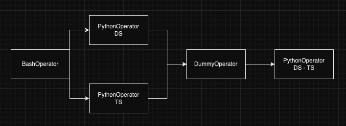

# PDI-engenharia-de-dados
Repositório com material para o PDI de engenharia e dados.

Vamos criar tópicos na medida que lançaremos os novos trabalhos práticos aqui no README junto com todos os arquivos necessários para poderem trabalhar.

- [PDI-engenharia-de-dados](#pdi-engenharia-de-dados)
    - [Detalhes sobre a infraestrutura](#detalhes-sobre-a-infraestrutura)
    - [Como usar a infra](#como-usar-a-infra)
  - [Trabalho prático 4 - Orquestração com Airflow e Geração de arquivo Parquet](#trabalho-prático-4---orquestração-com-airflow-e-geração-de-arquivo-parquet)
    - [Entrega](#entrega)
    - [Algumas observações sobre o trabalho](#algumas-observações-sobre-o-trabalho)
    - [Etapas do trabalho](#etapas-do-trabalho)


### Detalhes sobre a infraestrutura 
Sempre iremos usar, quando necessário, o Docker para rodar a infraestrutura necessária em cada trabalho. A sua instalação é bem simples ([doc](https://docs.docker.com/engine/install/)). Um problema que pode ser recorrente usando docker com algumas ferramentas que vamos precisar é a falta de memória, caso isso ocorra tente aumentar a memoria do seu ambiente docker ([mac](https://docs.docker.com/desktop/settings/mac/), [linux](https://docs.docker.com/desktop/settings/linux/), [Windows](https://docs.docker.com/desktop/settings/windows/)). Caso ainda assim tenha problemas de memoria, envie uma mensagem no canal do Discord que iremos ajudar vocês.

### Como usar a infra
1. Makefile tem alguns comandos, make airflow-up para subir o airflow por exemplo.
2. Para o Airflow, todas as dags precisam ser criadas na pasta `airflow/dags`, elas vão aparecer automaticamente na interface do airflow que estiver rodando.
3. Caso não conheçam, deem uma lida do [Poetry](https://python-poetry.org/docs/). Mas basicamente, vocês precisam instalar o Poetry e rodar poetry instala na raiz do repositório, ele irá criar um `.venv` que vocês podem usar (source .venv/bin/activate ou Poetry shell).

## Trabalho prático 4 - Orquestração com Airflow e Geração de arquivo Parquet
A ideia deste trabalho prático é criarmos algumas dags no Airflow para experimentarmos as algumas diferentes possibilidades que este orquestrador nos proporciona. Vamos dividir esse trabalho em 4 partes.

### Entrega
A entrega deste trabalho será por email, com um link para um fork deste repositório que cada um de vocês precisam fazer e com as etapas deste trabalho desenvolvidas. Para cada etapa, deve ser criada um commit com o formato `[tp4 - x] - <descrição>`, sendo o **X** a etapa solucionada pelo commit. Caso precisem fazer mais de um commit em tempo de desenvolvimento, por favor fazer um squash dos commits para facilitar a correção ([how to squash](https://www.geeksforgeeks.org/git-squash/)).

### Algumas observações sobre o trabalho
Precisamos a todo momento lembrar das boas práticas vista em aula sobre o airflow e algumas indicações para o nosso caso:
1. As dag precisam ser criadas dentro da pasta `airflow/dags` para serem carregadas no Airflow. Caso algum erro aconteça no carregamento da dag, ele será indicado no webserver.
2. O Airflow tem como usuário e senha padrão : airflow.
3. Todas as DAG's deste trabalho devem ter um schedule como nulo, a não ser que a tarefa especifique o contrário.
4. Toda task quando executada repetidamente precisa gerar o mesmo output (a não ser que a loja foi alterada). Assim sendo, não é indicado usar função que alterem o valor me diferentes execuções como datetime do Python. Outras boas práticas estão disponíveis nessa [doc](https://airflow.apache.org/docs/apache-airflow/stable/best-practices.html).
5. A corretude deste trabalho não é apenas a execução correta das tasks e das DAG's, mas também como foi feito a implementação das DAG's seguindo as boas práticas e indicações feitas em aula.
6. Qualquer dúvida, fique a vontade em enviar uma mensagem no grupo do discord (ajuda os outros colegas também), e também podem marcar um horário de mentoria.

### Etapas do trabalho

1. Criação de uma DAG simples:
Quero que vocês criem uma dag com um operador simples qualquer (a escolha de vocês ([operadores disponíveis](https://airflow.apache.org/docs/apache-airflow/stable/core-concepts/operators.html))). A ideia aqui é apenas criarem a dag, verem possíveis erros na criação pela interface rodarem a primeira task no airflow.


2. Criação de uma DAG com múltiplas tasks com comunicação entre as tasks:
    Nessa tarefa a ideia é criarmos uma DAG que tenha mais de uma tarefa, definindo as suas dependências. Para esse DAG vamos criar um fluxo de trabalho, em que teremos duas tasks:
    **a.** BashOperator: Apenas um print dizendo que foi iniciada a DAG
    **b.** PythonOperator: Duas task usando o operador que nos possibilita rodar qualquer função Python. Aqui também vamos focar na task e nas dependências e não em uma tarefa com conexão externa, por isso podem apenas imprimir em uma das tasks o `ds` e na outra task o `ts` que cada task está sendo executada ([usar as variáveis de template do Airflow](https://airflow.apache.org/docs/apache-airflow/stable/templates-ref.html)). Essas duas task's além de imprimirem os valores, precisam enviar via XCOM para as próximas tasks as informações relativas ao DS e TS que imprimiram ([doc](https://airflow.apache.org/docs/apache-airflow/stable/core-concepts/xcoms.html)) com as chaves do seus nomes: ds e ts.
    **c.** DummyOperator: Uma tarefa que não faz nada, é muito usada para poder sincronizar novamente a execução da DAG caso necessários. Em nosso caso queremos esperar que as duas tasks que usam o PythonOperator acabem usa execução. 
    **d.** PythonOperator ou BashOperator: Mais uma ultima task que é usada para concatenar as duas informações enviadas pelo XCOM (por isso o dummyOperator) no formato `<DS> -- <TS>` em que o `<DS>` é o valor de DS recebido e `<TS>` o valor de TS.


O formato final da DAG será: 
    
    

3. Criar uma dag com conexão externa para o banco de dados:
    Para essa tarefa vamos criar uma conexão com o banco de dados externo e fazer uma consulta em suas tabelas.
    **a.** Criar uma conexão no airflow para o banco Postgres que já está sendo executado no ambiente docker. Os dados da conexão são:
        
    ```
        conection_type: Postgres
        host: postgres
        DB: loja_carros
        login: airflow
        senha: airflow
        Porta: 5432
    ```
        
    **b.** Criar uma DAG que use essa conexão com o Postgres usando o [PostgresHook do Airflow](https://airflow.apache.org/docs/apache-airflow-providers-postgres/1.0.1/_api/airflow/providers/postgres/hooks/postgres/index.html) e uma primeira task usando o pythonOperator que faça a seguinte consulta nos dados:
    ``` SQL
    SELECT v.id, c.marca, c.modelo, cl.nome AS cliente_nome, f.nome AS funcionario_nome, v.data_da_venda, v.preco_de_venda
    FROM vendas v
    JOIN carros c ON v.carro_id = c.id
    JOIN clientes cl ON v.cliente_id = cl.id
    JOIN funcionarios f ON v.funcionario_id = f.id;
    ```
    O resultado dessa consulta precisa ser salvo em um caminho específico em formato csv (será dentro do worker do Airflow mesmo).
    **c.** Uma segunda task, também usando o PythonOperator, que consome o CSV criado pela primeira task e imprime em ordem de maior para menor o vendedor que vendeu o maior valor no formato : *Vendedor `x` faturou o valor `y` e ficou em `z` lugar*. Nessa frase substitua X pelo nome do vendedor, Y pela some do valor das vendas dele e Z pela posição que ele ficou no ranking. Podem fazer essa conta manualmente ou usar Pandas/Numpy. 

4. Criar uma dag usando API de dataset e Backfill de dados
    Nesta ultima tarefa, vamos criar duas DAG's que tem uma dependência entre elas. A API de dataset existente no Airflow ([doc](https://airflow.apache.org/docs/apache-airflow/stable/authoring-and-scheduling/datasets.html)) é muito útil quando temos esse senário para poder "triggar" uma DAG quando temos certeza que o dataset que ela usa já foi criado. A ideia vai ser separar as duas tasks que criamos na etapa 3 e separar em duas DAG's. Ambas as DAG's precisam de um scheduler diário e devem ser agendadas com um `start_date` de pelo menos 1 semana antes de sua primeira execução (o intuito aqui é fazer a execução backfill da nossa pipeline).
    **a.** Para a primeira dag, vamos pegar a primeira task da etapa 3, que faz a consulta no banco e salva um CSV e a única alteração que vamos fazer é adicionar uma criação de um Dataset no final da execução dessa task.
    **b.** Nessa segunda DAG, vamos executar apenas a segunda task da etapa 3, em que agregamos as informações de vendas por vendedor. A única alteração para essa DAG é que o trigger dela não é um tempo específico, e sim um Dataset criada no tópico **a** desse trabalho. Dessa forma garantimos que sua execução acontece assim que possível (quando o dataset a ser consumido está pronto).

